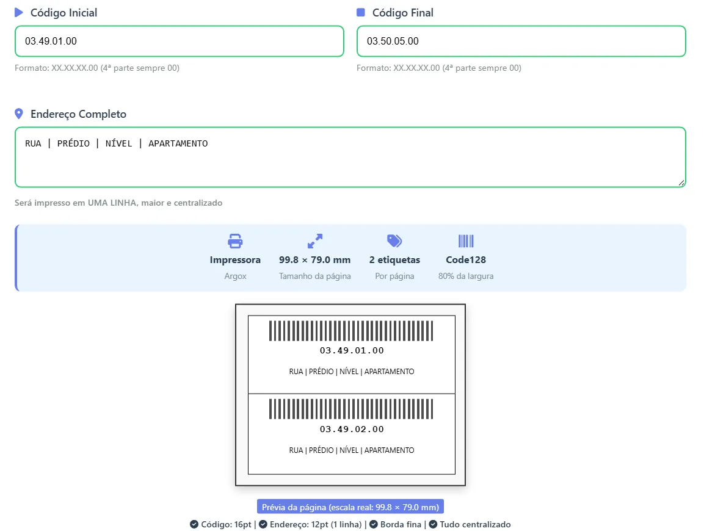

# 🏷️ WMS Microdata - Gerador de Etiquetas

Sistema de geração de etiquetas de endereçamento integrado ao ERP Microdata Sistemas para a Importadora DGB COMEX.



## 📋 Visão Geral

Este módulo foi desenvolvido para suprir a falta de um módulo WMS no sistema ERP da Microdata Sistemas, permitindo a geração automatizada de etiquetas de endereçamento para armazenamento com integração direta ao sistema existente.

## ✨ Funcionalidades

- ✅ **Geração de etiquetas** com código de barras Code128
- ✅ **Layout otimizado** para impressora Argox (99.8 × 79.0 mm)
- ✅ **2 etiquetas por página** com bordas definidas
- ✅ **Código de barras centralizado** (80% da largura)
- ✅ **Texto do endereço em uma linha** e centralizado
- ✅ **Servidor de rede** para acesso multiplataforma
- ✅ **Prévia em tempo real** do layout
- ✅ **Cálculo automático** da quantidade de etiquetas
- ✅ **QR Code** para acesso rápido via celular
- ✅ **Interface web responsiva**

## 🏗️ Arquitetura do Sistema

```
WMS_MICRODATA/
│
├── 📁 Etiquetas/           # Diretório principal
├── 📁 src/                 # Código fonte Python
├── 📁 static/              # Arquivos estáticos (CSS, JS)
│   └── style.css          # Estilos da interface
├── 📁 templates/           # Templates HTML
│   ├── index.html         # Interface principal
│   └── network_info.html  # Informações de rede
├── 📄 app.py              # Aplicação Flask principal
├── 📄 config.py           # Configurações do sistema
├── 📄 etq_endereco.py     # Lógica de geração de etiquetas
├── 📄 requirements.txt    # Dependências Python
├── 📄 start_server.bat    # Script de inicialização Windows
├── 📄 INSTRUCOES_REDE.md  # Instruções de configuração de rede
├── 📄 .gitignore          # Arquivos ignorados pelo Git
├── 📄 LICENSE             # Licença do projeto
└── 📄 README.md           # Esta documentação
```

## 📦 Requisitos do Sistema

- **Python 3.8+**
- **Impressora Argox** compatível com etiquetas 99.8 × 79.0 mm
- **Conexão de rede local** para acesso multiplataforma
- **Navegador web moderno** (Chrome, Firefox, Edge)

## 🔧 Instalação

### Método 1: Script Automático (Windows)

1. **Clone o repositório ou extraia os arquivos**
2. **Execute como Administrador:**
   ```bash
   start_server.bat
   ```
3. **Siga as instruções** que aparecerão no terminal
4. **Anote o IP** exibido para acesso na rede

### Método 2: Instalação Manual

#### 1. Instale as dependências:
```bash
pip install -r requirements.txt
```

Dependências instaladas:
```
flet>=0.24.0
reportlab>=0.24.0
Flask>=3.0.0
netifaces==0.11.0
```

#### 2. Execute o servidor:
```bash
python app.py
```

#### 3. Acesse a interface:
- **Localmente:** http://127.0.0.1:5000
- **Na rede:** http://[SEU-IP]:5000

## 🌐 Configuração de Rede

### Para acesso multiplataforma:

1. **Certifique-se** que todos os computadores estão na mesma rede Wi-Fi/Ethernet
2. **Permita conexões** na porta 5000 no firewall do Windows
3. **Acesse** a página de informações de rede em: `http://[IP-DO-SERVIDOR]:5000/network`

### URLs disponíveis:
- **Computador servidor:** `http://127.0.0.1:5000`
- **Computadores na rede:** `http://[IP-DO-SERVIDOR]:5000`
- **Celular/tablet:** Escaneie o QR Code na página de informações

## 🖨️ Formato das Etiquetas

### Especificações técnicas:
- **Tamanho da página:** 99.8 × 79.0 mm
- **Etiquetas por página:** 2
- **Tamanho da etiqueta:** 90 × 35 mm
- **Margens:** 4.9 mm horizontal, 4.5 mm vertical
- **Código de barras:** Code128 (80% da largura)
- **Fonte do código:** Helvetica-Bold 16pt
- **Fonte do endereço:** Helvetica 12pt

### Formato do código de endereçamento:
```
XX.XX.XX.00
├──┬┘ ├──┘ ├──┬┘ ├──┘
│  │  │    │  │  │
│  │  │    │  │  └── 4ª parte: Sempre 00 (fixo)
│  │  │    │  └───── 3ª parte: Varia de 01 a 05
│  │  │    └──────── 2ª parte: Varia de 01 a 99
│  │  └───────────── 1ª parte: Identificação principal
│  └──────────────── Formato fixo: XX.XX.XX.00
└─────────────────── Exemplo: 03.49.01.00
```

## 🔄 Lógica de Sequenciamento

### Regras de incremento:
1. **4ª parte** sempre permanece `00`
2. **3ª parte** incrementa de `01` até `05`, depois:
   - Reseta para `01`
   - Incrementa a 2ª parte
3. **2ª parte** incrementa de `01` até `99`, depois:
   - Reseta para `01`
   - Incrementa a 1ª parte
4. **1ª parte** incrementa conforme necessidade

### Exemplo de sequência:
```
Início: 03.49.01.00
  → 03.49.02.00
  → 03.49.03.00
  → 03.49.04.00
  → 03.49.05.00  (3ª parte chegou a 05)
  → 03.50.01.00  (2ª parte incrementada)
  → 03.50.02.00
  ... até o código final
```

## 💻 Como Usar

### Passo a passo:

1. **Acesse** a interface web
2. **Informe** o código inicial (ex: `03.49.01.00`)
3. **Informe** o código final (ex: `03.50.05.00`)
4. **Digite** o endereço completo (ex: `RUA | PRÉDIO | NÍVEL | APARTAMENTO`)
5. **Verifique** a prévia e a quantidade calculada
6. **Clique** em "Gerar PDF Final"
7. **Imprima** o PDF na impressora Argox

### Validações automáticas:
- ✅ Formato correto do código
- ✅ 4ª parte sempre igual a `00`
- ✅ Código final maior que o inicial
- ✅ Endereço não pode estar vazio

## 🚀 Inicialização Avançada

### Opções de execução:

```python
# Executar em IP específico
python app.py --host 192.168.1.100 --port 8080

# Executar sem modo debug
python app.py --debug false

# Executar com logging detalhado
python app.py --log-level DEBUG
```

### Configuração do firewall (Windows):
```powershell
# Permitir porta 5000 no firewall
netsh advfirewall firewall add rule name="Gerador Etiquetas" dir=in action=allow protocol=TCP localport=5000

# Verificar regra
netsh advfirewall firewall show rule name="Gerador Etiquetas"
```

## 🛠️ Solução de Problemas

### Problema: Servidor não inicia
**Solução:**
```bash
# Verifique se a porta 5000 está disponível
netstat -ano | findstr :5000

# Se ocupada, mude a porta no app.py
app.run(host='0.0.0.0', port=5001, debug=True)
```

### Problema: Não consigo acessar na rede
**Solução:**
1. Verifique se os computadores estão na mesma rede
2. Desative temporariamente o firewall
3. Verifique o IP com `ipconfig` (Windows) ou `ifconfig` (Linux/Mac)
4. Acesse `http://[IP-CORRETO]:5000`

### Problema: PDF não gera
**Solução:**
1. Verifique se o ReportLab está instalado: `pip show reportlab`
2. Verifique permissões de escrita na pasta temporária
3. Verifique memória disponível

## 📊 Exemplos Práticos

### Exemplo 1: Pequeno lote
```
Início: 01.01.01.00
Final:  01.01.03.00
Endereço: CORREDOR A | RUA 1 | NIVEL 1
Quantidade: 3 etiquetas
Páginas: 2 páginas
```

### Exemplo 2: Lote médio
```
Início: 05.25.01.00
Final:  05.26.05.00
Endereço: SETOR B | PRATELEIRA 5 | NÍVEL 2
Quantidade: 10 etiquetas
Páginas: 5 páginas
```

## 🔒 Segurança

### Considerações importantes:
- ⚠️ **Apenas para rede local** - Não exponha na internet
- 🔐 **Sem autenticação** - Use apenas em rede confiável
- 📁 **Backup regular** - Mantenha cópia dos templates
- 🔄 **Atualizações** - Mantenha dependências atualizadas

### Boas práticas:
1. Execute em rede local isolada
2. Desative quando não estiver em uso
3. Mantenha logs de uso
4. Faça backup das configurações

## 🤝 Contribuição

Este sistema foi desenvolvido como solução específica para a Importadora DGB COMEX. Para personalizações ou melhorias, entre em contato com o desenvolvedor.

## 📞 Suporte e Contato

**Desenvolvedor:** Tiago de Abreu  
**Email:** hello@tiagoabreu.dev  
**Instagram:** [@devtiagoabreu](https://instagram.com/devtiagoabreu)  
**LinkedIn:** [Tiago de Abreu](https://linkedin.com/in/devtiagoabreu)  
**Facebook:** [@devtiagoabreu](https://facebook.com/devtiagoabreu)

## 📄 Licença

Este projeto está licenciado sob a licença MIT. Veja o arquivo [LICENSE](LICENSE) para detalhes.

## ⚠️ Isenção de Responsabilidade

Este sistema não possui apoio ou afiliação oficial com a Microdata Sistemas. Foi desenvolvido como solução independente para suprir necessidades específicas da Importadora DGB COMEX. Use por sua própria conta e risco.

## 🔄 Histórico de Versões

### v1.0.0 (2024)
- ✅ Versão inicial estável
- ✅ Geração de etiquetas com código de barras
- ✅ Interface web responsiva
- ✅ Servidor de rede local
- ✅ Prévia em tempo real
- ✅ Cálculo automático de quantidade

---

**Importadora DGB COMEX** • **ERP Microdata Sistemas** • **Módulo WMS Independete**
```

## 📁 Arquivos de Configuração Adicionais

### Para `requirements.txt` completo:
```txt
Flask==3.0.0
reportlab==4.0.0
netifaces==0.11.0
flet==0.24.0
qrcode==7.4.2
Pillow==10.1.0
```

### Para `.gitignore`:
```gitignore
# Python
__pycache__/
*.py[cod]
*$py.class
*.so
.Python
build/
develop-eggs/
dist/
downloads/
eggs/
.eggs/
lib/
lib64/
parts/
sdist/
var/
wheels/
*.egg-info/
.installed.cfg
*.egg

# Virtual Environment
venv/
ENV/
env/
.venv/

# IDE
.vscode/
.idea/
*.swp
*.swo

# OS
.DS_Store
Thumbs.db

# Logs
*.log

# Database
*.db
*.sqlite3

# PDFs gerados
*.pdf
```

### Para `LICENSE` (MIT):
```text
MIT License

Copyright (c) 2024 Tiago de Abreu

Permission is hereby granted, free of charge, to any person obtaining a copy
of this software and associated documentation files (the "Software"), to deal
in the Software without restriction, including without limitation the rights
to use, copy, modify, merge, publish, distribute, sublicense, and/or sell
copies of the Software, and to permit persons to whom the Software is
furnished to do so, subject to the following conditions:

The above copyright notice and this permission notice shall be included in all
copies or substantial portions of the Software.

THE SOFTWARE IS PROVIDED "AS IS", WITHOUT WARRANTY OF ANY KIND, EXPRESS OR
IMPLIED, INCLUDING BUT NOT LIMITED TO THE WARRANTIES OF MERCHANTABILITY,
FITNESS FOR A PARTICULAR PURPOSE AND NONINFRINGEMENT. IN NO EVENT SHALL THE
AUTHORS OR COPYRIGHT HOLDERS BE LIABLE FOR ANY CLAIM, DAMAGES OR OTHER
LIABILITY, WHETHER IN AN ACTION OF CONTRACT, TORT OR OTHERWISE, ARISING FROM,
OUT OF OR IN CONNECTION WITH THE SOFTWARE OR THE USE OR OTHER DEALINGS IN THE
SOFTWARE.
```

Esta documentação cobre todos os aspectos do sistema, desde instalação até uso avançado, incluindo informações de contato do desenvolvedor e instruções específicas para o contexto da Importadora DGB COMEX.